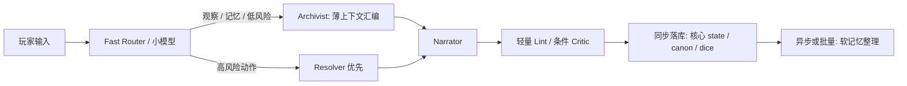

# call-of-claw 单机 Call of Claw 架构演进报告

## 执行摘要

基于urlcall-of-claw 仓库turn1view0、url架构红线文档turn2view1、url里程碑文档turn2view2以及关键源码模块，我的总体判断是：这个项目的方向是对的，而且已经具备“通用 TRPG GM runtime”的关键骨架；接下来最值得做的，不是继续把前台做成更重的多 agent，而是把现有基础收束成**渐进式披露 + 双层 Narrator/Archivist + 条件触发轻量后台 advisors**。仓库已经实现了包化规则/剧本、确定性 resolver、世界状态 patch、记忆与 canon、critic、scenario director、回放与评测，这意味着你距离“更快、更像真人、更跨规则”之间，缺的主要是工程上的**上下文组织、缓存层次、风格层、规则抽象层**，而不是再发明一套全新框架。citeturn8view0turn8view4turn34view0turn9view5

我给你的关键决策建议只有五条：

- **首选架构**：以“渐进式披露 + 双层 Narrator/Archivist”为主线，把现有轻量 advisors 改成**条件触发**，不要把单机场景继续推进成重多-agent。citeturn31view3turn30view2turn39search11turn39search15
- **最优先提速点**：先改检索与缓存，而不是先换更大模型。当前检索还是逐包读文本+子串匹配；advisor cache 又把 `turn_id` 编进了 `run_id`，更像回放缓存而不是跨回合加速缓存。citeturn15view0turn15view2turn23view1turn22view2
- **真人化策略**：不要放松规则/事实 guardrail，而要把“风格”做成独立层。你当前 prompt 明确强调同语言、开放式提问、避免越权夸饰、保持 concise playable；这保证了可靠性，但也会抑制真人 GM 的节奏感、声线与角色味道。citeturn30view0turn30view1turn30view2turn30view3
- **跨规则策略**：继续把差异压在 content package、resolver adapter、机会（opportunity）与 patch 授权层，不要回流到 core graph。项目现在已经有 `threshold_d6`、`sum_target`、`percentile_under` 三类 resolver 和通用 disclosure policy，这是非常好的边界。citeturn19view0turn17view6turn31view4turn9view5
- **预期收益**：如果按我下面的顺序实施，单回合中位延迟有现实机会下降约 **35%–65%**，GM 文本的“像真人”和“角色一致性”会明显提升；这是基于仓库结构的工程估算，不是你当前仓库已经给出的公开基准。结合 API 侧 prompt caching，稳定前缀场景的收益会更明显。citeturn39search0turn39search1

## 现状判断

仓库当前已经不是“单大 Prompt + 骰子工具”的原型，而是一套带红线约束的通用 GM runtime：核心原则包括“规则和场景属于包，不属于核心逻辑”“风险动作必须走 resolver”“持久事实不能从 prose 直接落库”“隐藏信息不能泄露”“内部字段统一英文、玩家可见文本跟随玩家语言”。当前 GM loop 也已经明确分成：加载运行时上下文、并行检索记忆/内容、意图与规则建议、形成 TurnPlan、执行确定性工具、scenario director 提 patch、Narration、Critic、Memory Curator、持久化 trace 与状态。citeturn8view0turn8view4turn8view5

更重要的是，这些设计不是只停留在文档。README 明确写出了当前已有 specialist advisors、独立模型选择、advisor cache、规则 family registry、SQLite 持久层、评测与质量报告、交互式 CLI，并且已经暴露 `--single-turn-advisor` 与 `--parallel-review` 运行选项。citeturn34view0turn34view1turn34view3turn37view0turn37view1

下表是我对当前实现“已经很好”和“真正卡住目标”的拆解。表中“当前实现证据”均来自仓库文档和源码。citeturn8view0turn34view0turn15view0turn23view1turn29view2

| 子系统 | 当前实现 | 对目标的价值 | 当前短板与我认为的演进点 |
|---|---|---|---|
| 核心架构边界 | 通用 runtime；规则/场景内容包化；危险动作必须走 resolver；持久状态只能来自 tool/world patch/canon。citeturn8view0turn8view4 | 这是跨规则适配的根基，方向正确。 | 不要再把具体规则塞回 graph；下一步应做“更细的规则抽象层”，而不是放宽边界。 |
| 检索层 | `search_registry_text()` 会遍历 package，读取 reference 文本，用标题/标签/正文的轻量子串命中计分；返回 top-k，且 span 文本截断到前 4000 字。citeturn15view0turn15view2turn32view0turn32view1 | 简单可靠，便于保证通用性。 | 这是单回合速度与上下文质量的首要瓶颈之一；内容越多，I/O 与误召回越明显。 |
| 记忆层 | SQLite 持久化；`memories_fts` 用 FTS5；检索区分 GM-only 与 player-visible；里程碑文档说明已有 canon / world state / memory / unresolved threads / episodic summary 基线。citeturn14view3turn14view7turn9view0 | 为长局连续性与 recap 提供可靠基础。 | 目前更像“事实记忆”，还不是“风格记忆 / 行为轨迹记忆 / NPC 关系记忆”；而且摘要策略仍偏固定。 |
| 规则层 | resolver registry 已支持 `threshold_d6`、`sum_target`、`percentile_under`；resolver 产出 authoritative narration constraints 和 world patches。citeturn19view0turn17view6turn18view5 | 跨 TRPG 的主干已经建立。 | 还需要一个更显式的规则抽象 DSL/插件接口，方便持续接入新 ruleset。 |
| 场景与披露 | package manifest 已有 `ProgressiveDisclosurePolicy`；scenario director patch 有严格校验；world patch 模型明确。citeturn31view3turn16view5turn16view7turn32view6 | 渐进式披露已经是项目核心思想，不需要推倒重来。 | 还可以把披露粒度从“引用片段级”继续推进到“叙事节拍级 / NPC 知情级”。 |
| 叙事与守卫 | Narration prompt 要求：同玩家语言、尊重 tool result、保持开放式玩家能动性、concise and playable；critic 会拦截 hidden leak、unsupported fact、resolver bypass、player_agency 违例。citeturn30view0turn30view2turn30view3turn29view3 | 可靠性非常强。 | “像真人”不足的主要原因就在这里：当前风格层太薄，且 critic 主要管事实与边界，不负责塑造 GM 声线。 |
| Advisor 调度 | advisor 输入会 hash；`run_id` = `turn_id + role + prompt_version + input_hash[:16]`；存 SQLite，可命中缓存。citeturn22view2turn23view1 | 对 replay / 幂等 / 调试很有帮助。 | 因为 cache key 带 `turn_id`，它本质上**不是跨回合 prefix cache**；对“单回合更快”的帮助有限。 |
| 评测体系 | 现有 scorecard 已含 `rules_correctness`、`fictional_authority`、`continuity`、`player_agency`、`pacing`、`progressive_disclosure`、`memory_behavior`、`narration_quality`。citeturn29view2 | 已具备回归与长期可靠性基线。 | 还缺“真人感 / NPC 区分度 / 风格一致性 / GM 样本相似度”等风格向指标。 |

你当前最关键的项目级洞察，是下面这两条：

第一，**你已经有“多角色后台”，但还没有真正完成“面向单回合低延迟的调度收敛”**。现有架构适合保证正确性，但在单机、单玩家、无 UI 的场景里，并不是每一回合都值得跑完整 advisors 链；尤其是纯观察、短问答、记忆问答、低风险动作，其实可以走更短的 fast path。这个判断既来自仓库现有 specialist advisor 设计，也符合urlLangChain 多 Agent 文档turn39search11和urlLangGraph workflows/agents 文档turn39search15的经验：不是所有复杂任务都值得拆成多 agent，很多工作流用单 agent + 动态工具/条件分支就够了。citeturn34view0turn39search11turn39search15

第二，**你现在“像真人”的短板，更多来自“缺少风格与表演层”，而不是基础能力不足**。当前 prompt 强调不替玩家做决定、不强制二选一、不要越权添加持久后果、保持局部行动范围，这很好；但如果没有额外的 GM persona、NPC speech style、情绪/节奏控制器，模型就会本能收敛到“功能正确但风味较淡”的守卫式文体。citeturn30view1turn30view2turn30view3


上图不是源码逐节点复刻，而是根据架构红线文档总结出的运行主路径；与当前仓库描述是一致的。citeturn8view4

## 首选架构

我的建议不是把现有系统改成“更重”的协作群体，而是把它收敛成**前台双层、后台轻量条件触发**：

- **Archivist**：负责上下文预算、事实汇编、披露边界、场景压力、NPC 状态、规则机会、记忆写入候选；
- **Narrator**：只负责本回合最终 GM 文本——说什么、怎么说、说到哪一步；
- **轻量后台 advisors**：仅在满足条件时触发，例如高风险规则判定、跨 scene 转场、critic 高风险检查、复杂记忆归档。  
这条路线最适合你现在的代码基底，因为 package、resolver、scenario patch、memory、critic 都已存在；你不是从零起步，而是把已有部件改成更合理的组织方式。citeturn8view4turn31view3turn23view1

下表是我针对你这个项目，而不是抽象 agent 系统，给出的架构优先级排序。评估依据包括仓库现状、urlReAct 论文turn39search2关于“推理+工具动作交错”的经验，以及上面两份官方工作流/多 agent 文档对单 agent/多 agent边界的建议。citeturn39search2turn39search11turn39search15

| 方案 | 适配 call-of-claw 的方式 | 优点 | 代价 | 对“更快” | 对“更像真人/更符合扮演” | 对“多规则适配” | 推荐 |
|---|---|---|---|---|---|---|---|
| 单大 Prompt | 用一个模型同时做路由、规则、叙事、记忆写入 | 实现最简单；适合 demo | 容易回退到 ruleset leakage、resolver bypass、风格与事实耦合 | 中 | 低到中 | 低 | 仅作 fallback |
| 渐进式披露 + 单 Narrator | 保留 package/披露机制，只让一个 Narrator 消费精简上下文 | 延迟较低，工程简单 | 事实汇编与风格写作耦合在一起 | 高 | 中 | 中到高 | 可作过渡方案 |
| **双层 Narrator + Archivist** | Archivist 汇编“本回合必要事实”；Narrator 只写 final text | **最平衡**；最适合你现有代码 | 需要重构上下文拼装器 | **高** | **高** | **高** | **首选** |
| 轻量多 advisors 后台 | 保留 intent/rules/scenario/critic/memory，但改成条件触发/并行/小模型 | 保留可靠性和可解释性 | 调度复杂度上升 | 中到高 | 高 | 高 | 强烈推荐作为首选方案的配套 |
| 重多-agent协作 | 前台也拆成多个会话 agent 轮流辩论/协商 | 论文/展示效果好 | 单机场景延迟太高，收益不成比例 | 低 | 中到高 | 中 | 不推荐 |

更直白地说：**你的项目不缺 multi-agent；缺的是“哪些 agent 必须存在、哪些 agent 只该在必要时出现”的纪律**。目前仓库已经有多角色 advisor 思想，但单机单回合目标要求你把它们变成“按需出现的后台工人”，而不是“每回合都要上场的会议室”。citeturn34view0turn37view0turn37view1

推荐目标图如下：



这张图表达的是**“硬事实先行、文风后置、软记忆延后”**。与当前架构相比，最大的变化不是新增模块，而是把 Narrator 从“既写文又背上下文包袱”的状态里解放出来。这样做既能缩短每回合 prompt，又能明显提高文风可控性。citeturn8view4turn30view2turn39search2

## 单回合提速

如果目标明确是“单回合更快”，我建议你把优化顺序从“模型优先”改成“路径优先”。你现在已经有并行检索、advisor cache、compact contract、deterministic resolver 等基础，但它们还没有被组织成真正的低延迟方案。最值得先做的是下面这八条。citeturn26view3turn22view5turn34view0

| 优化策略 | 具体做法 | 预期加速 | 主要副作用 | 缓解方式 |
|---|---|---:|---|---|
| 上下文预算器 | 把 prompt 分成稳定前缀、会话摘要、场景局部、规则局部、记忆命中五层；每层独立预算，溢出时先裁掉低价值引用 | 10%–20% | 误裁重要线索 | 对 rules/scenario 引用加“不可裁”标签 |
| 跨回合 prefix cache | 保留现有 turn-scoped advisor cache，同时新增“与 turn_id 无关”的前缀缓存层；把 system prompt、package manifest、风格卡、稳定 tool schema 固化为固定前缀 | 10%–30%；API 侧可更高 | 前缀稍变会失效 | 把前缀拆成多段、版本化；稳定部分尽量前置 |
| 检索索引化 | 把当前逐包读文件+子串匹配改成离线倒排索引或 FTS/vector 混合；至少先把 content 检索做成本地 index，而不是每回合扫文件 | 15%–35% | 索引构建复杂 | 先做 SQLite FTS/BM25，再考虑 vector |
| Resolver 优先 fast path | 高风险动作先 resolver，再进入 Narrator；Narrator 不再自己消化“有没有必要判定” | 10%–25% | info/free-action 被误判为 risky 会多一次开销 | 先用小模型 router + 几条确定性规则兜底 |
| 小模型做前台决策，大模型只做成文 | routing / rules / scenario / memory 用小模型；Narrator 在需要风格化成文时用大模型 | 20%–45% | 小模型误路由 | 建立回归集；对高风险动作强制再校验 |
| 条件运行 critic / memory curator | 低风险观察/问答回合只跑轻量 lint，不跑 full critic；memory curator 改成“scene change / durable event / N turns”触发 | 10%–25% | 漏掉局部质量问题 | 对 hidden leak、resolver bypass 保留强制检查 |
| 模板化叙事缓存 | 对“观察、记忆回顾、规则说明、旅行推进、装备查看”等高频 turn type 使用模板骨架，Narrator 只补局部变量 | 5%–15% | 文本变公式化 | 只用于低戏剧密度回合；高张力回合继续自由生成 |
| 并行扩展到“汇编层” | 现在只并行检索 memory/content；下一步把 world projection、NPC stance 汇总、style pack 装配也并行化 | 5%–15% | trace 更复杂 | trace 按 branch 命名，保持可回放 |

这里最关键的一条，是**跨回合 prefix cache**。因为你当前 advisor 的 `run_id` 由 `turn_id + role + prompt_version + input_hash[:16]` 拼成，仓库也正是据此从 SQLite 取 cached advisor run；这意味着它非常适合 replay、同 turn 重试和幂等，但天然不适合“不同 turn 之间因为前缀很像而加速”。而 urlOpenAI Prompt Caching 文档turn39search0与urlAnthropic Prompt Caching 文档turn39search1都明确说明，**稳定前缀**正是 API 级缓存最容易产生收益的地方。换句话说：你现在的缓存层是“正确的”，但不是“最赚钱的”。这是一个非常明确、回报很高的演进点。citeturn22view2turn23view1turn39search0turn39search1

另一个大头是检索。当前 `search_registry_text()` 的策略非常朴素：生成 query terms，读取 reference 文本，拼 title/tags/text 做轻量命中计分，再截断前 4000 字返回。这个设计在仓库规模小的时候足够优雅，但一旦 ruleset、scenario、扩展 skill 包增多，速度和召回质量都会同时成为问题；尤其是你要兼容多 TRPG 时，规则正文和剧本正文都会迅速膨胀。我的建议不是一步到位接向量数据库，而是按这条顺序来：**先离线预编译索引 → 再做 FTS/BM25 → 最后再决定是否要 hybrid vector。**citeturn15view0turn15view2turn32view0

一个可直接落地的上下文预算器，我建议写成这样：

```python
from dataclasses import dataclass
from typing import Any

@dataclass
class Budget:
    stable_prefix: int = 1800
    scene_local: int = 900
    rules_local: int = 700
    memory_hits: int = 500
    recent_canon: int = 500
    style_pack: int = 300

def build_turn_context(
    player_input: str,
    package_profiles: list[dict[str, Any]],
    scene_snapshot: dict[str, Any],
    rules_snippets: list[str],
    memory_hits: list[str],
    recent_canon: list[str],
    style_pack: dict[str, Any],
    budget: Budget = Budget(),
) -> dict[str, Any]:
    return {
        "stable_prefix": clip(package_profiles, budget.stable_prefix),
        "scene_local": clip(scene_snapshot, budget.scene_local),
        "rules_local": clip(rules_snippets, budget.rules_local),
        "memory_hits": clip(memory_hits, budget.memory_hits),
        "recent_canon": clip(recent_canon, budget.recent_canon),
        "style_pack": clip(style_pack, budget.style_pack),
        "player_input": player_input,
    }
```

这里的关键不是 `clip()` 本身，而是**显式分层预算**。你现在的项目已经有 progressive disclosure policy、package profile、memory hits、retrieved spans 和 world projection；只要把这些输入从“堆到一起”改成“分桶预算”，延迟和稳定性都会更好。citeturn31view3turn8view4turn26view3

## 真人化与规则适配

### 真人化

你当前 Narration prompt 的价值观是健康的：同语言、开放式玩家能动性、不要强迫二选一、不要凭空夸大后果、保持 concise and playable。问题不在这些约束，而在于**你目前没有显式的 GM 表演层**。如果没有单独的风格层，模型就只能在“安全正确”与“语感饱满”之间自己猜平衡点，结果通常是前者占优。citeturn30view1turn30view2turn30view3

所以，“更像真人”的正确路线不是把 critic 关掉，也不是单纯改成更大的 Narrator 模型，而是给 Narrator 一个**稳定、可持久、可规则无关复用**的 style pack。这个 style pack 应该由 Archivist 产出，至少包含：

- GM persona：语气、镜头距离、悬疑/冒险/战斗的节奏曲线；
- 台风约束：是否偏短句、是否常用开放提问、是否 inline 报骰；
- NPC 说话参数：各 NPC 的语速、用词层级、回避/挑衅/安抚倾向；
- 情绪状态：当前 scene 的压力、恐惧、幽默、沉默比例；
- taboo list：本局禁止的表达习惯，例如“替玩家决定”“过度 summarization”“机械性复述检索条目”。

我建议把它做成 ruleset/scenario 无关的 session 级对象，保存在 world projection 外的一层“style state”。因为 style 不是事实，不应该和 canon/world patch 混在一起。citeturn8view0turn30view2

一个够用的 persona/state 结构可以是这样：

```json
{
  "gm_style_id": "investigative_slowburn_v1",
  "narrative_distance": "close",
  "question_style": "open_ended",
  "dice_reveal_style": "inline_exact",
  "dialogue_ratio": 0.35,
  "pressure_curve": "slow_rise",
  "allowed_sensory_palette": ["sound", "temperature", "texture"],
  "npc_voice_rules": {
    "innkeeper": {"tone": "warm_hidden_anxiety", "verbosity": "medium"},
    "cultist": {"tone": "controlled", "verbosity": "low"}
  },
  "taboo_patterns": [
    "force_binary_choice",
    "decide_player_action",
    "invent_unauthorized_damage"
  ]
}
```

随后让 Narrator 只做一件事：**在“已授权事实包”之内，按 style pack 成文**。这样你既不会放松事实边界，又能明显改善“像真人 GM”的问题。当前 critic 其实已经很好地阻止了许多“虽然华丽但越权”的写法；这正是为什么风格层必须独立出来。citeturn29view3turn30view3

如果你愿意进一步投入数据，真人化最值得做的不是大规模 SFT，而是**小规模风格蒸馏**：收集你认为“像真人 GM”的 transcript 片段，把它们标成“观察、推进、报骰后果、NPC 对话、追问、scene close”几类，用 few-shot exemplar 检索给 Narrator。对这种项目，5k–20k 条高质量 turn-level 样本通常已经足够产生明显差异；LoRA/SFT 可以放在后面，因为你当前的主要问题不是“模型不会写”，而是“写的时候缺身份”。这是工程判断。与其先训模型，不如先把风格输入做对。  

### 规则适配

在跨规则方面，你的仓库其实已经有相当好的起点。`PackageKind` 里已经把 capability skill、ruleset、scenario、extension 等边界分开；manifest 里也已经有 `ProgressiveDisclosurePolicy`、references、capabilities、extension prompts/tools；而 resolver registry 也已经覆盖了至少三类判定族。citeturn31view5turn31view4turn19view0

因此，我不建议你再设计一个很重的“统一规则语言”去替代当前系统；更可行的是加一层**薄 DSL / 统一 JSON schema**，把“玩家动作 → 规则程序 → 掷骰请求 → 结果带 → 机会/后果 → 世界 patch”这条链条显式标准化。这样不同 TRPG 的差异就主要落在插件接口里，而不是落在 graph prompt 或 Narrator prompt 里。citeturn17view6turn18view5turn32view6

一个我认为适合你项目的抽象长这样：

```json
{
  "intent": {
    "kind": "risky_action",
    "fictional_goal": "撬开门锁并保持安静",
    "target": "archive_door",
    "stakes": "是否惊动楼内的人"
  },
  "procedure": {
    "ruleset_id": "coc7",
    "resolver_family": "percentile_under",
    "approach_id": "locksmith",
    "requested_roll": "1d100"
  },
  "outcome": {
    "band": "success",
    "authorized_effects": [
      {"op": "set", "path": ["door", "archive_door", "locked"], "value": false},
      {"op": "append", "path": ["revealed_facts"], "value": "门锁结构已被看清"}
    ],
    "opportunities": []
  }
}
```

在实现层面，我建议把 resolver adapter 接口固定成下面这样：

```python
from typing import Protocol, Any

class RulesetPlugin(Protocol):
    id: str
    family: str

    def prepare(self, action: dict[str, Any], character: dict[str, Any], scene: dict[str, Any]) -> dict[str, Any]:
        ...

    def resolve(self, prepared: dict[str, Any], *, session_id: str, turn_id: str) -> dict[str, Any]:
        ...

    def explain_public(self, result: dict[str, Any], style: dict[str, Any]) -> dict[str, Any]:
        ...
```

这样做的好处有三点：

- core graph 永远只认识 `prepare / resolve / explain_public`；
- ruleset 差异体现在 plugin 和 manifest，而不是 prompt 分支；
- Narrator 只消费 `authorized_effects` 与 `public explanation`，不会被某个具体 TRPG 绑架。  

当前里程碑已经把 genericity across games 作为正式目标，并说明已有三种 ruleset family、三种 scenario 结构通过同一套 core graph 跑交叉评测；所以你完全不需要推翻现状，只需要把这条思路做得更“插件化”和更“可持续”。citeturn9view5turn8view5

有一个项目级细节也值得你提前注意：虽然 scenario transition 已经是 package-owned，而不是 core-owned，但 `_transition_patches_for_band()` 里仍允许根据 `action_keywords` 和 `action.lower()` 做 transition 命中。这当然已经比在 core 里写规则词表好很多，但对高度自由叙述的玩家输入，它仍然可能成为长尾错过转场的来源。我的建议是中期把这部分逐渐迁到**显式 transition predicate** 或 **Archivist 产出的结构化 scene trigger**，不要长期依赖 action keyword。citeturn17view7

## 实施路线与评测

我建议你按三个阶段推进，而不是一口气做重构。因为你现在最大的优势，是仓库已经有 long-play、replay、release gates 和 scorecard；这意味着每个阶段都可以做成可验证的小闭环，而不是豪赌一次大改。citeturn9view3turn9view4turn29view2

| 阶段 | 核心目标 | 主要工作 | 资源估算 | 验收标准 |
|---|---|---|---|---|
| 短期 | 先把单回合做快 | 上下文预算器；content 检索索引化；prefix cache；safe-turn 条件 critic；small-model router | 1–2 名工程师，约 2–4 人周（估算） | P50 延迟下降 20%+；规则/hidden leak 指标不退化 |
| 中期 | 让 GM 更像真人 | Archivist/Narrator 分层；style pack；NPC voice state；few-shot exemplar 检索；新增 human-likeness 评测 | 2–3 名工程师，约 4–8 人周（估算） | narration_quality 与 human-likeness 指标提升；玩家能动性不下降 |
| 中长期 | 稳定跨规则扩展 | 规则 DSL；resolver plugin API；transition predicate；多 ruleset 黄金回归集；版本兼容测试 | 2–4 名工程师，约 2–3 个月（估算） | 新增 ruleset/scenario 不改 core graph；genericity gate 持续通过 |

你当前评测体系已经覆盖了规则正确性、连续性、玩家能动性、节奏、渐进式披露、记忆行为和叙事质量，这是一条很强的起跑线。下一步最值得补的，是三个新维度：

- **human_likeness**：像不像真人 GM；
- **voice_consistency**：同一 session 内 GM 声线是否稳定；
- **npc_distinctiveness**：不同 NPC 的说话方式、情感强度、信息披露边界是否可区分。  

建议的量化方法是：保留现有 scorecard 维度不变，再增加一个 style judge，输入包括 transcript、style pack、NPC 状态快照和一个少量真人 GM 对照集。这样做的好处是，你不会把“文风更像真人”误优化成“事实更不可靠”。citeturn29view2turn29view3

如果要做最小可用的新评测集，我会这样设计：

| 测试集 | 目的 | 最低规模 |
|---|---|---:|
| 黄金短剧本 | 回归规则、隐藏信息、场景推进 | 20–30 个 case |
| 高频 turn type 集 | 观察、问答、回忆、开锁、交涉、推进 | 每类 20 条 |
| 长局连续性集 | 30–100 turn continuity / memory / pacing | 5–10 局 |
| 风格对照集 | 人类 GM 样本 vs 模型输出对照 | 200–500 turn 片段 |
| 跨规则集 | 至少 3–5 个 ruleset 的相同行为抽象测试 | 每 ruleset 20–40 case |

资源上，如果你只做单机、无多人、无 UI，预算压力主要来自推理调用与评测，而不是产品面。我的工程估算是：

- **低配**：1 名主程 + 少量 API 评测；月度推理/评测成本约几百美元级；适合先把“快”和“稳定”做出来；
- **中配**：2 名工程师 + 兼职规则/GM 标注；月度成本约千美元级；可以开始做风格层与多 ruleset 回归；
- **高配**：3–4 名工程师 + 风格样本整理 + LoRA/SFT；成本显著上升，但更像“研究开发”而不是“工程迭代”。  
以上都是估算，不是仓库已有公开成本数据。  

## 开放问题与局限

下面这些点，我认为需要在你真正动手前先明确：

- 公开仓库没有给出真实线上对局转录、P50/P95 延迟曲线或按节点拆分的真实耗时，因此我上面给出的加速比例都属于**工程估算**，不是已测结果。仓库文档能确认有 trace、advisor metrics 和 quality report，但不能替代真实生产 profile。citeturn34view0turn9view3turn9view7
- 我无法从已公开材料确认 `--single-turn-advisor` 与 `--parallel-review` 在你当前实际游玩流程中的默认使用频率和收益，只能确认 CLI 与 README 已暴露这些模式。citeturn34view1turn37view0turn37view1
- 当前检索与场景转场逻辑的真实误召回/漏召回率也没有公开 benchmark；因此“检索索引化”和“transition predicate 化”是高概率正确的方向，但优先级仍应以你自己的 trace/profile 复核。citeturn15view0turn17view7

## 结论与工程清单

结论很明确：**可行，而且应该继续沿着你现在的通用 runtime 路线走，但要从“功能分得很细”进化到“路径收得很紧”**。就你这个项目当前状态而言，最优解不是重多-agent，不是单大 Prompt，也不是先做 UI；而是：

- 用 **双层 Narrator/Archivist** 取代“一个 Narrator 背上下文包袱”；
- 把现有轻量 advisors 改成 **条件触发的小后台**；
- 在性能上先做 **检索索引化、prefix cache、small→large 调用分层**；
- 在文本质量上增加 **style pack、NPC voice state、few-shot exemplar**；
- 在跨规则上做 **规则 DSL + resolver plugin API**，不要回流 core graph。  

这些建议与仓库当前的红线、里程碑、resolver family、package model 和评测体系都是同向的，不需要推倒重写。citeturn8view0turn9view5turn31view4turn29view2

下面给你一份可以直接交给工程团队的快速实施清单：

- 把现有 online play 路径拆成 `Fast Router -> Archivist -> Narrator -> conditional Critic`。
- 新建 `ContextBudgeter`，把 scene/rules/memory/canon/style 做成分桶预算，不再把所有上下文平铺到 Narrator。
- 保留当前 turn-scoped advisor cache，同时新增跨 turn 的 prefix cache；把 system prompt、style pack、package manifest 做成稳定前缀。
- 把 content 检索从“逐文件读文本”升级到离线索引；先做 FTS/BM25，不急着一开始上向量库。
- 设定三档 profile：`fast`、`balanced`、`theatrical`；`fast` 默认用紧凑 contract + 小模型 routing + 条件 critic。
- 把 risky action 统一改成 resolver 优先，Narrator 只消费 authoritative consequence envelope。
- 新增 `style_state`，不要把风格记忆混入 canon/world patch。
- 为 NPC 增加 `stance + voice + last-emotion + secrecy-boundary` 组合状态。
- 新增 human-likeness 评测维度；现有 scorecard 保留，另加 style judge，不要把“更像真人”优化成“更会胡编”。
- 中期把 scenario transition 从 `action_keywords` 逐步迁向结构化 trigger/predicate。
- 长期把新 ruleset 的接入流程标准化成：manifest → plugin → golden cases → replay → release gate。  

如果只允许你先做三件事，我会选这三件：

- **先做检索索引化 + 上下文预算器；**
- **再做 prefix cache + small→large 路由；**
- **最后做 Archivist/Narrator 分层和 style pack。**

这是你当前项目里，投入产出比最高、同时又最不破坏现有可靠性边界的演进方向。citeturn15view0turn23view1turn30view2turn39search0turn39search1